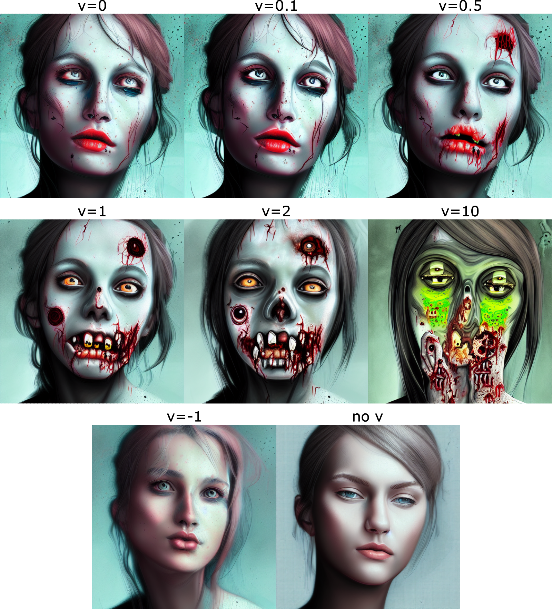

# Stable-Diffusion + Fused CUDA kernels = FUN!

## Introduction

So you want to learn more about stable-diffusion (SD), and how it works, to dive deep into its implementation but the original source is too complicated?
Or do you just want a nice API to use SD and perhaps implement your own image generation?
Or you wrongly clicked this repo when you actually intended to click on something else?

No fear, you came to the right place!

Are you impatient? [Click here](##-Installation) for the demo code.

## How and why?

The original codebase [diffusers](https://github.com/huggingface/diffusers) is a bit too overly-complicated.
Most of us are only interested in SD and we do not care too much about other implementations.
So there is a need for a repository that is focused on only developing SD.

Additionally, the original codebase is too long, the classes and functions are not separated into their files, it has many bad practices in terms of typing (or the lack of typing at all in some parts), and also legacy python 2 practices that are not modern anymore.
This makes reading the code to understand how SD works very hard and the fact that VS-code screams at me with red errors everywhere does not help any bit (due to lack of typing).
As an example, they use a function `get_down_block` that has an input string and it creates a block used in SD.
Good luck getting any typing information on that.

To fix these issues and the many bugs that come with such implementation, I decided to re-code SD from the ground up with [diffusers](https://github.com/huggingface/diffusers) in mind for HEAVY "inspiration" (kudos for the original codebase though!).
Now everything has its own file, things are pretty, well-coded (wink), and might serve as a good guide for anyone trying to implement such a system.
Try reading the implementation of [DDIM scheduler](https://github.com/tfernd/sd-fused/blob/master/sd_fused/scheduler/ddim.py) and compare it with the [original](https://github.com/huggingface/diffusers/blob/main/src/diffusers/schedulers/scheduling_ddim.py) one (85 lines of code instead of 305).

This new rewriting comes with many good features, such as renaming parameters and layers to be more uniform.
Better handling of internal states passed by up/down blocks.
Creating new layers that will be fused later on and better organization of layers in general.

## Kernel fusion

I'm currently writing some CUDA kernels for some layers that will be fused.
Such as Normalization+Activation+Linear/Convolution layers, and, of course, attention!
I plan on using [FlashAttention](https://github.com/HazyResearch/flash-attention) (also implemented by [xformers](https://github.com/facebookresearch/xformers)), but I'm doing my own implementation (it takes time...).

## Installation
```bash
pip install -U git+https://github.com/tfernd/sd-fused
```
## Text2Image generation

Base code for text-to-image generation.

```python
from IPython.display import display
from sd_fused.app import StableDiffusion

# Assuming you downloaded SD and put it in the folder below
pipeline = StableDiffusion('.pretrained/stable-diffusion-v1.4')

# If you have a GPU with 3-4 Gb use the line below
# pipeline.set_low_ram().half_weights().cuda()
pipeline.half().cuda()
pipeline.split_attention(cross_attention_chunks=1)

imgs = pipeline.text2img(
    prompt=f'''
    portrait of zombie, digital art, detailed, artistic
    ''',
    negative_prompt='old man',
    steps=28,
    scale=11,
    height=512,
    width=512,
    seed=42,
)
for img in imgs:
    display(img)
```


## Emphasis 

Using the notation `(few words):factor` you can give emphasis (high number), take out emphasis (small number), or even avoid the subject (negative number).
It works (tokens) inside the parentheses are given a weight that is passed down to the attention calculation, ehancing, attenuating or negative the attention to the given token (negative attention is weird).

Below is a small tests where the word `zombie` is given different emphasis.
The last image is the image generation without the word `zombie` (no v).


```python
for v in [0, 0.1, 0.5, 1, 2, 10, -1]:
    out = pipeline.text2img(
        prompt=f"""
        portrait of female (zombie):{v}, digital art, detailed, artistic
        """,
        steps=26,
        scale=11,
        height=512,
        width=512,
        seed=42,
    )
    for img, path in out
        display(img)
````


