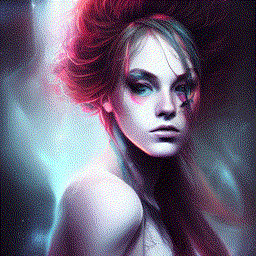

# Stable-Diffusion + Fused CUDA kernels = FUN!

## For the impatiens:

Using the notation `(a few words):weight` you can give emphasis (high number), take out emphasis (small number), or even avoid the subject (negative number).
The words (tokens) inside the parentheses are given a weight that is passed down to the attention calculation, ehancing, attenuating or negative the attention to the given token.

Below is a small tests where the word `cyberpunk` is given different emphasis.

```python
for t in np.linspace(-1.2, 4.2, 32):
    out = pipeline.text2img(
        prompt=f"portrait, woman, cyberpunk:{t}, digital art, detailed, epic, beautiful",
        steps=24,
        scale=11,
        height=512,
        width=512,
        seed=1658926406,
        eta=0.6,
    )
```


## Introduction

This is a re-written implementation of Stable-Diffusion (SD) based on the original [diffusers](https://github.com/huggingface/diffusers) and [stable-diffusion](https://github.com/CompVis/stable-diffusion) repositories (all kudos for the original programers).

The goal of this reimplementation is to make it clearer, more redable, upgradable code that is easy to read and modify.
Unfortunately the original code is very difficult to read due to the lack of proper typing, variable naming and other factors.

## Kernel fusion

This is an ongoing project to fuse many layers as possible to make it more memory friendly and faster.

## Installation

```bash
pip install -U git+https://github.com/tfernd/sd-fused
```

## Text2Image generation

Base code for text-to-image generation.

```python
from IPython.display import display
from sd_fused.app import StableDiffusion

# Assuming you downloaded SD and put it in the folder below
pipeline = StableDiffusion('.pretrained/stable-diffusion')

# If you have a GPU with 3-4 Gb, use the line below
# pipeline.set_low_ram().half_weights().cuda()
pipeline.half().cuda()
pipeline.split_attention(cross_attention_chunks=1)
# if you have xformers installed, use the line below
# pipeline.flash_attention()

imgs = pipeline.text2img(
    prompt='portrait of zombie, digital art, detailed, artistic',
    negative_prompt='old man',
    steps=28,
    scale=11,
    height=512,
    width=512,
    seed=42,
)
for img in imgs:
    display(img)
```


<!-- ## TODO list -->